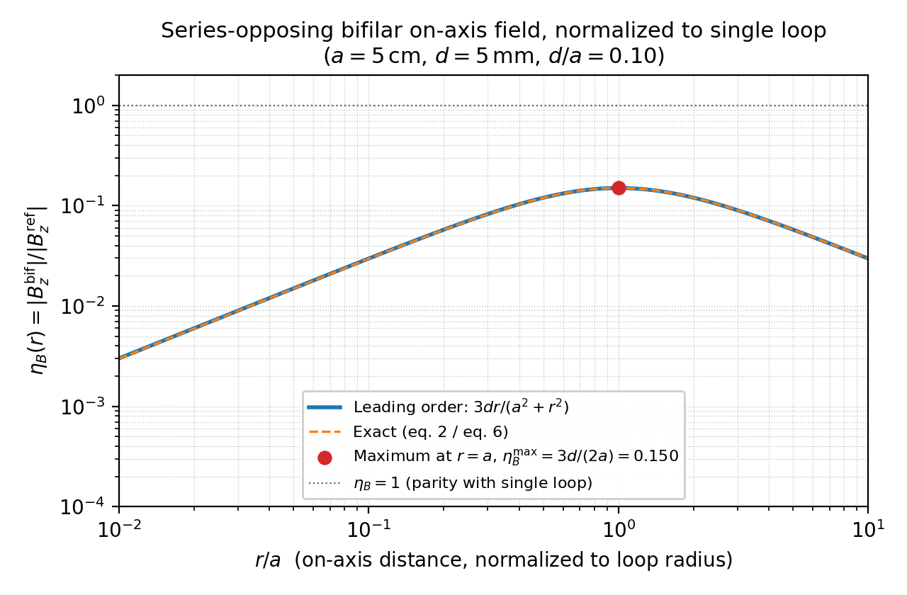

# Field theory primer

<!-- Source: docs/derivations/*, wiki: Psi Field, Bifilar Coil, Schumann
     Status: stub
     TODO: 10-12 pages. Bifilar/caduceus near-field math, dipole far-field
           comparison, Schumann envelope band (7.83 / 14.3 / 20.8 / 27.3 /
           33.8 Hz), why we modulate at envelope rates rather than at the
           carrier.
     LANDED:
       - Bifilar near-field enhancement factor (Track C, v0 2026-05-18):
         see ../../derivations/bifilar_near_field_enhancement.md
         Result: eta_B(r) = 3 d r / (a^2 + r^2), max = 3d/(2a) at r = a.
         Honest reading: bifilar geometry is WEAKER on-axis than a same-
         current single loop everywhere. The interesting property is the
         steep gradient and rapid r^-4 far-field falloff, not amplitude.
         Figure: figures/fig04_bifilar_enhancement.png
-->

This chapter is a working primer on the field theory the HelmKit platform
takes seriously: near-field vs. far-field, the bifilar / caduceus geometries,
and the Schumann envelope modes used as low-frequency modulation targets.

Derivations referenced here are owned end-to-end by the project and live
under `docs/derivations/`. Where the result depends on a primary source
(Persinger 2012, Bandyopadhyay microtubule resonance, McFadden CEMI,
Hameroff/Penrose Orch-OR), the source is cited but the math is rederived
locally.

## Landed derivations (v0)

- **Bifilar near-field enhancement.** A series-opposing axial bifilar pair
  with loop radius $a$ and axial separation $d \ll a$, driven at current
  $I$, produces an on-axis field ratio (relative to a same-current single
  loop)
  $$\eta_B(r) = \frac{3\,d\,r}{a^2 + r^2} + \mathcal{O}(d^2/a^2),$$
  maximized at $r = a$ where $\eta_B^{\max} = 3d/(2a)$. For the Mk0.5 /
  Mk1 geometry ($a = 5\,\mathrm{cm}$, $d = 5\,\mathrm{mm}$) this gives
  $\eta_B^{\max} = 0.15$ — i.e., the bifilar pair is **weaker on-axis than
  a single loop carrying the same current, everywhere on the axis**.
  Full derivation, numerical table, and reproducibility footer:
  [`../../derivations/bifilar_near_field_enhancement.md`](../../derivations/bifilar_near_field_enhancement.md).
  Paired notebook: [`../../../notebooks/bifilar_near_field.py`](../../../notebooks/bifilar_near_field.py).
  Figure: 

  Engineering reading: the bifilar geometry's value is not amplitude. It is
  (a) the localized gradient near $r = a$, (b) the $r^{-4}$ far-field
  falloff that makes the device intrinsically low-leakage, and (c) the
  near-perfect common-mode rejection that drops resistive emissions out of
  the radiating multipole expansion. Mk1.5 will measure $\eta_B(r)$ with a
  3-axis magnetometer; agreement with $3dr/(a^2+r^2)$ to $\pm 20\,\%$ is
  the F3/F4 precursor for the F2-probe physics-probe protocol.
